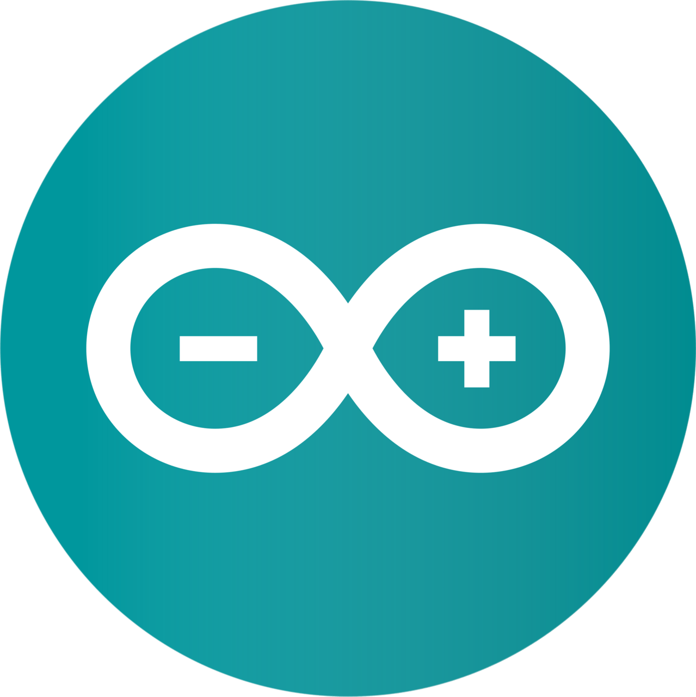

<h1 align="center">
  <a href="https://git.io/typing-svg">
    
  </a>
</h1>

<p align="center">
  <a href="https://www.linkedin.com/in/ezequielbamio/"></a>
</p>

<br>


```c
void Bienvenidos(){

 char nombre[] = "Ezequiel Bamio"
 char nacionalidad[] = "Argentina"
 int edad = 20
 
 char descripcion[] = "Estudiante de la Universidad Tecnológica Nacional (FRA)."
 char carrera[] = "Tecnicatura Universitaria en Programación."
 char estado[] = "Cursando el 2do cuatrimetres."

}
```
<h2 align="center">🔥 Lenguajes & Frameworks 🔥</h2>
<br>
<p align="center">
    <code></code>
  <code></code>
  <code></code>
  <code></code>
  <code></code>
  <code></code>
  <code></code>
</p>

<h2 align="center">⚡ Herramientas de desarrollo ⚡</h2>
<br>
<p align="center">
  <code></code>
  <code></code>
  <code></code>
  <code></code>  
</p>
<hr>

<br>
  <p align="center">
    
  </p>

